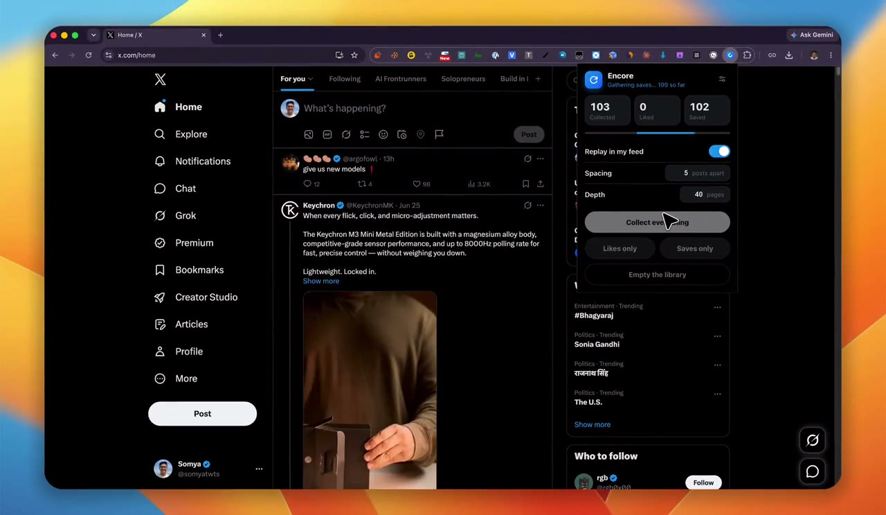

<div align="center">


# Encore

**Your liked and saved posts are the best feed you never scroll.**

Encore quietly brings them back around in your X timeline — each tagged so you know why
it's there — and keeps a private, local archive of everything you've ever saved.

<p>
  
  
  
  
  <a href="LICENSE"></a>
</p>

</div>

---

## See it in action

<div align="center">
  <a href="https://github.com/mesomya/encore/blob/main/docs/encore-demo.mp4">
    
  </a>
  <br />
  <sub><b>▶ Watch the 1-minute demo</b> — collect your liked &amp; saved posts, then watch them resurface in your feed. <i>(Click to play on GitHub.)</i></sub>
</div>

<!--
  Prefer an AUTOPLAYING inline player instead of click-to-play? The clip is only ~5 MB:
  open a new Issue, drag docs/encore-demo.mp4 into it, copy the generated
  https://github.com/user-attachments/assets/…  URL it produces, and paste that URL on
  its own line just above this comment. GitHub then renders an inline autoplay player.
  The poster above is the no-upload fallback.
-->

## Screenshots

| Popup | Dark | Options |
| :---: | :---: | :---: |
|  |  |  |

<div align="center">
  
  <br />
  <sub>Resurfaced posts woven into Home (dark + light) — native styling, with a small "You liked this / You bookmarked this" line.</sub>
</div>

## Why

You save and like posts you mean to come back to — and then never do. They sink into a
list you forget exists. Encore turns that buried list into a gentle, ambient feed: as you
scroll Home, it slips your own saved gems back in, spaced out, so they resurface naturally
instead of rotting in a folder. And because it keeps a local copy, you build a private,
searchable-by-you archive of everything you've found worth keeping.

## Features

- 🪄 **Resurfaces your own posts** into Home — every few real posts, one of yours slides
  in, tagged **You liked this** / **You bookmarked this**.
- 🎚 **In your control** — one master switch, plus **Spacing** (how often) and **Depth**
  (how far back a collect walks). Bring back likes, saves, or both.
- 🧲 **One-click collecting** — visit your Bookmarks or Likes page once so Encore learns
  the request, then hit **Collect** in the popup. Re-run it anytime to pull in what's new.
- 🎨 **Pixel-native** — inherits X's font, spacing, action bar, and theme (Default / Dim /
  Lights-out), so resurfaced posts read as part of the timeline, not an overlay.
- 🔒 **100% local** — a private IndexedDB archive on the extension's own origin. No
  server, no account, no telemetry. Ever.
- 🪶 **Tiny & dependency-free** — vanilla JS, Manifest V3, ~40 KB.

## How it works

X's web app talks to a private GraphQL API using credentials only the page itself holds
(a bearer token, the `ct0` CSRF token, a per-request transaction id). Rather than forge
any of that, Encore **rides along with the requests X already makes:**

1. While you're on x.com, Encore observes — read-only, at the browser's network layer —
   the calls X fires to load your **Bookmarks** and **Likes**, and **remembers each
   request's shape**. It never blocks or modifies traffic.
2. On **Collect**, it replays that remembered request with a pagination cursor, walking
   page-by-page through your history into a private local database.
3. As you scroll Home, it counts real posts and, every few, weaves one of yours back in —
   appended *inside* a real tweet cell so X's own layout engine keeps everything aligned.

Collection runs only when you click it in the popup — Encore never collects or shows
anything on its own. Nothing leaves your machine that the page wasn't already sending to X.

> 📐 Want the deep version — the three execution contexts, the cross-world messaging, and
> the decisions behind it? See [`docs/ARCHITECTURE.md`](docs/ARCHITECTURE.md).

## Install

> Encore isn't on the Chrome Web Store (yet), so you load it unpacked. It works on any
> Chromium browser — Chrome, Edge, Brave, Arc — and needs **Chrome 111+ (Manifest V3)**.
> **Safari is not supported** (different extension format).

**From a release zip**

1. Download `encore.zip` from [Releases](../../releases) and unzip it.
2. Open `chrome://extensions` → turn on **Developer mode** (top right).
3. Click **Load unpacked** → select the unzipped **`encore`** folder (the one containing
   `manifest.json`).

**From source**

```bash
git clone https://github.com/mesomya/encore.git
```

…then **Load unpacked** → select the `encore` folder.

## First run

1. Pin Encore (🧩 puzzle icon → 📌).
2. On **x.com** (logged in), open your **Bookmarks** page once, and your **Likes** tab
   once. That's the one-time step that teaches Encore the request it replays — it happens
   silently in the background.
3. Open the Encore popup → **Collect everything**, then head to Home and scroll.

Re-run **Collect** from the popup whenever you want to pull in newly saved posts.

## Configuration

| Control | What it does |
| --- | --- |
| **Replay in my feed** | Master switch for slipping posts into your timeline. |
| **Spacing** | Show one of yours every _N_ real posts (default 5). |
| **Depth** | How many pages to walk per source when collecting (default 40). |
| **Collect everything / Likes only / Saves only** | Pull history for both kinds or one. |
| **Empty the library** | Wipe the local database (two-tap confirm). |
| **Options (⚙)** | Choose what to bring back, avoid repeats per visit, set appearance. |

## Privacy

- All data lives in a local **IndexedDB** on the extension's own origin — not readable by
  x.com, never uploaded anywhere.
- Host access is limited to `x.com` / `twitter.com`. The other permissions are `storage`
  (the local archive), `scripting` (attach to an x.com tab that was already open when
  Encore loaded), and `webRequest` — used **read-only**, to observe the Bookmarks/Likes
  request X already makes so Encore can replay it. It never blocks or changes traffic.
- Encore reads **only your own** liked and saved posts, through your own logged-in
  session — the same data X already shows you.

## Development

No build, no dependencies. Edit a file, hit **↻ reload** on the Encore card in
`chrome://extensions`, hard-refresh your x.com tab. See
[`CONTRIBUTING.md`](CONTRIBUTING.md) for the workflow and how to test, and
[`docs/ARCHITECTURE.md`](docs/ARCHITECTURE.md) for how everything fits together.

```
encore/
├─ manifest.json        # MV3 manifest
├─ src/
│  ├─ page-hook.js      # MAIN world: captures + replays X's GraphQL requests
│  ├─ content.js        # ISOLATED world: bridge + weaves cards into the timeline
│  ├─ background.js     # service worker: IndexedDB archive, settings, collect
│  ├─ mixer.css         # styles for the woven-in cards
│  └─ popup/            # the control panel
├─ icons/               # generated PNG icons
├─ tools/make-icons.mjs # regenerates the icons (no dependencies)
└─ docs/                # architecture notes + screenshots
```

## Contributing

Issues and PRs welcome — see [`CONTRIBUTING.md`](CONTRIBUTING.md). The short version:
keep it vanilla, keep it local, and don't let look-alike request names sneak into the
collector. 🙂

## License

[MIT](LICENSE) © 2026 Somya

---

<sub>Encore is an independent personal project and is **not affiliated with, endorsed by,
or sponsored by X Corp.** "X" and related marks belong to their respective owners. It
reads only your own data, through your own session, on your own machine.</sub>
